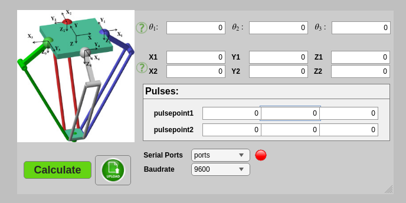

# Delta Robot Control (MATLAB App Designer + Arduino)

##  Overview
This project implements a **MATLAB App Designer GUI** for controlling a **3-DOF Delta Robot** using **Arduino and servo motors**.  
The GUI allows both **kinematic calculations (FK/IK)** and **real-time control** of servos via serial communication.

---

##  GUI Features

- 
- **Joint Angle Input (θ1, θ2, θ3)** – manually set servo angles  
- **Cartesian Coordinates Input (X, Y, Z)** – move end-effector by position  
- **Pulse Control** – send raw pulse values to servos  
- **Serial Communication Panel**  
  - Select COM port  
  - Set baudrate (default `9600`)  
  - Connect/Disconnect button  
- **Calculate Button** – compute FK/IK and update outputs  

---

##  Kinematics
- **Forward Kinematics (FK):** Compute `(X,Y,Z)` from servo angles `(θ1,θ2,θ3)`.  
- **Inverse Kinematics (IK):** Compute servo angles needed to reach a desired `(X,Y,Z)`.  
- FK is mainly for **validation & visualization**, IK is used for **control**.  

---

##  Pulse & Transmission
1. MATLAB computes servo angles (via IK).  
2. Angles are converted to **PWM pulse widths** (e.g., 500–2500 µs).  
3. GUI sends these values to Arduino over **USB serial**.  
4. Arduino updates the servos using the **Servo library**.  

---

##  Arduino Integration
- Arduino sketch listens for serial commands from MATLAB.  
- Each command is mapped to servo angles.  
- PWM signals are sent to the **3 servo motors**.  

---

##  Project Files
- `delta_forward_kinematics.m` – Forward kinematics  
- `inverseKinematics.m` – Inverse kinematics  
- `pulseGenerator.m` – Converts angles → PWM  
- `sendDataOverUSBToArduino.m` – Serial comm handler  
- `sendPulseRow.m` – Sends multiple servo values  
- `transition.m` – Smooth trajectory handling  

---

##  Notes
- Update robot geometry in `inverseKinematics.m` for your Delta robot.  
- Servo calibration is required before running trajectories.  
- Ensure an external power supply for servos.  

---

-     Developed by Mohammad Mahdi Khaligh
